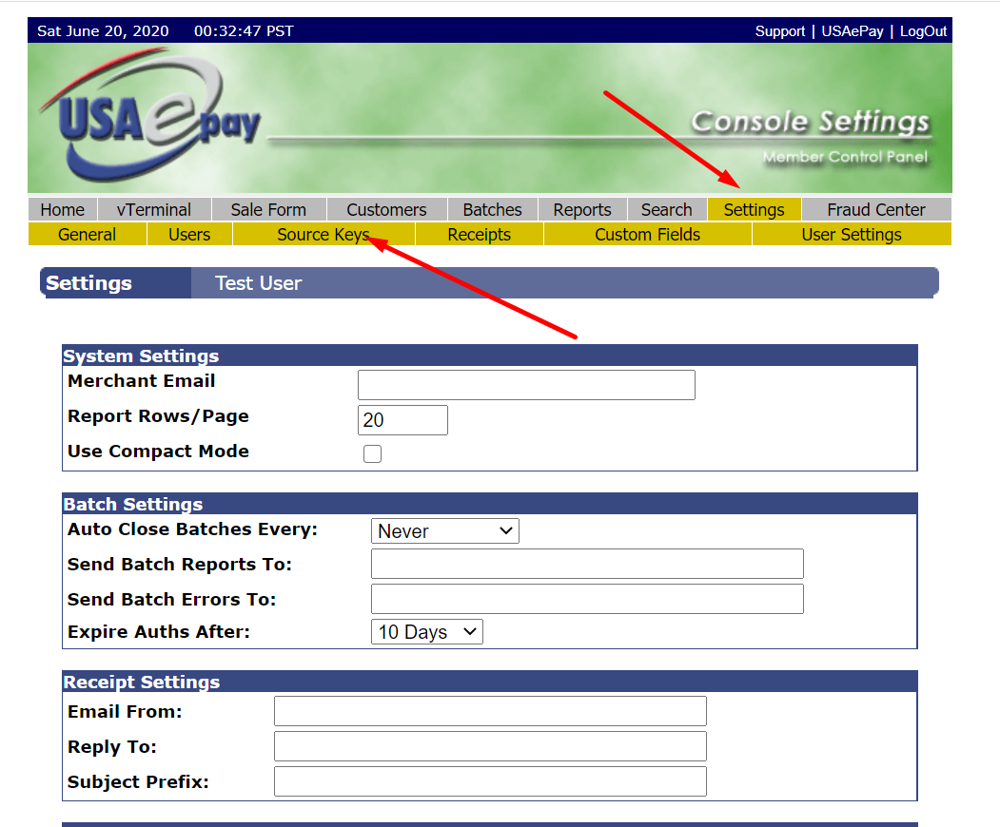

# API Keys

* Login to your USAePay [Merchant Console](https://secure.usaepay.com/login)

* From your home page, click on “Settings” > “Source Keys”  in the menu. In the sub menu, press “API Keys”

* Press the “Add API key” button

* Add a Name for your woocommerce website
* A PIN is required.
* Under “Allowed Commands”, enable everything but “Cash Sale” and “Cash Refund”
* Add your store’s email to the “Email Merchant Receipt To” textarea

