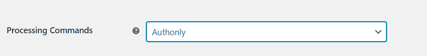
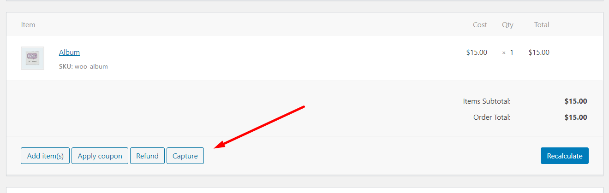

# Authonly

If you set "Authonly" in processing commands in the settings, you must manually capture and settle payments in your USA ePay control panel or on the WooCommerce orders screen after the transaction has been submitted. 

 

  
