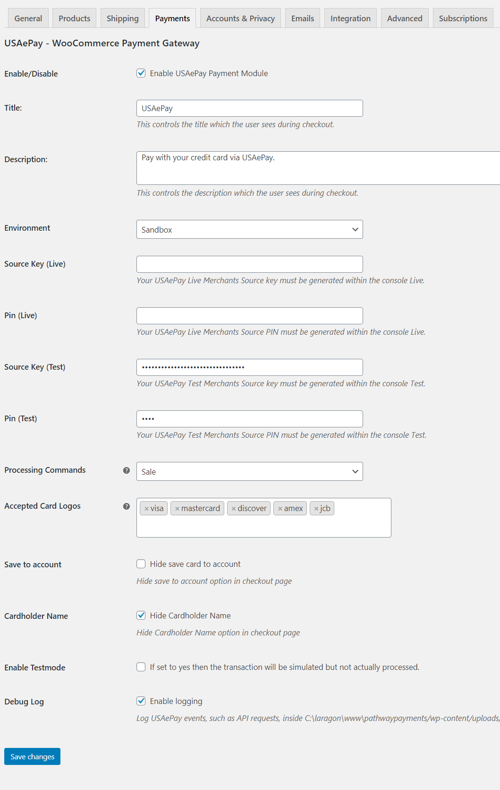

# PLugin Settings

The settings for the plugin are located under WooCommerce > Settings > Payments > USAePay

  * **Enable / Disable** – This will enable the gateway to be used by customers to checkout.
  * **Title** – This is the text shown for the payment during checkout and on the Order Received page.
  * **Description** – This is the text shown under the title during checkout. 
  * **Environment**  – This is control of transaction if test "sandbox" or live "production" mode.
  * **Source Key (Live)** – This is API key live mode.
  * **Pin (Live)** – This is API PIN live mode.
  * **Source Key (Test)** – This is API key test mode
  * **Pin (Test)** – This is API PIN test mode.
  * **Processing Commands** – This controls how transactions are submitted to USA ePay. You may choose either “Sale” or “Authonly”. If you select “Authonly”, you must manually capture and settle payments in your USA ePay control panel or on the WooCommerce orders screen after the transaction has been submitted. This defaults to “Sale”.
  * **Accepted Card Logos** – This credit card logos do you want to accept.
  * **Save to account** – This control if you want to hide save the card token to the account.
  * **Cardholder Name** – This control if you want to hide the cardholder name option in the checkout page.
  * **Enable Testmode** – This control if you want to test live credit card to production mode.
  * **Debug Log** – This control if you want logs the request and response of the API transactions.
  * **Enable / Disable** – This will enable the gateway to be used by customers to checkout.
  * **Title** – This is the text shown for the payment during checkout and on the Order Received page.

  
