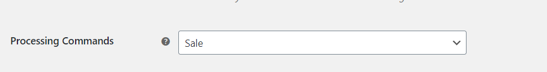

# Sale

If you set "Sale" in processing commands in the settings, the USAePay transactions will be automatically charged.

It will charge (debit) the customer's credit card for the amount specified. If the charge is successful the transaction will be placed in the merchant's currently open batch for settlement. As long as the merchant has their batch set to autoclose, no further action is required to capture these funds.

 